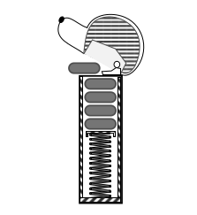

# Stack visualization

This is an attempt at an assignment given in my Design and Analysis of Algorithms class
It involves coding a representation of a PEZ Candy dispenser using Python based on the screenshot below.

# Status

**Completed**, but that depends on how you choose to define complete. None of the 3 implementations come close to the
screenshot above though.

It is complete enough to be accepted.

# Structure

This project is organized into three packages

1. [piston_spring](./piston_spring)
2. [line_spring](./line_spring)
3. [image_spring](./image_spring)

Each package has it own main.py file.

There is also a [menu](./menu) package which contains the interface for carrying performing the stack operations and
updating the candy dispenser. Additionally, there is the python-list based implementation of the [stack](./stack.py)
and an assets folder holding the image used in the image_spring package.

There is also a [vectors_experiment.py](./vectors_experiment.py) file where
I was experimenting with linear interpolation and drawing lines for 1 and 2 above.

Each of the three package represents an approach I used to represent the spring.

## 1. piston_spring

This was a fun one with animation (simple linear interpolation) but the spring was just a solid rectangle.

## 2. line_spring

The spring here was just a collection lines which moved up and down with a regular interval
based on whether a candy was added or popped.

## 3. image_spring

The spring here was an image of a spring which is being scaled up or down based on whether
a candy was added or popped.

This implementation is the most visually appealing of the three, in my opinion. (Yes, even without the animation)

# Remarks

This project was a very good exercise in learning pygame. However, the main purpose of the
project was to learn how to use the stack data structure. In that regard, it was not very helpful as the use of 
the stack was too insignificant, in my opinion. This project (and even its assessment)
was focused more on the GUI.

